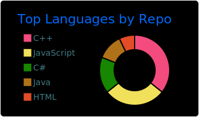
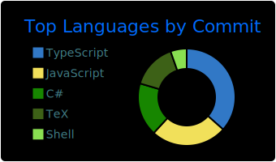
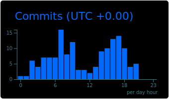

# Hey! I'm [@jarx64](https://github.com/jarx64) (Jahangir Alam Rocky) 👋

I'm a backend application developer from [Dhaka, Bangladesh 🇧🇩.](https://maps.app.goo.gl/naB3BVf8KvFRnxQB9)

I enjoy working with Go, .NET, Node.js, and the Unity engine.

## 🔗 You can find me on:

* [My website: jarx64.github.io](https://jarx64.github.io/)
* [GitHub as @jarx64 (you are here)](https://github.com/jarx64)
* [LinkedIn](https://linkedin.com/in/jahangir1x)
* [Mail](mailto:jahangir64r@gmail.com)
* [Facebook](https://fb.me/rocky10x)

## 📊 Github stats:

<!--      -->
    
    

